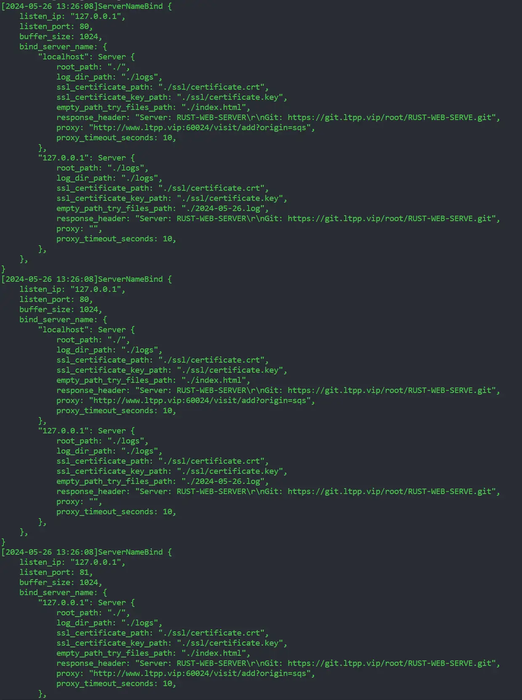
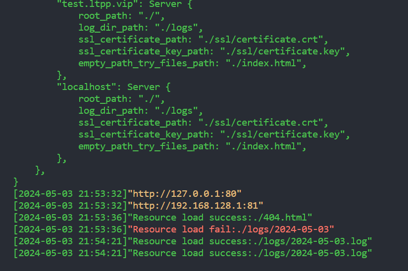

# 基于RUST的WEB资源服务器

> 该项目于2024年5月1日开始开发

## 预期功能

| 功能                                       | 支持情况 | 当前情况 |
|--------------------------------------------|----------|----------|
| 多线程支持                                  | 是       | 是       |
| 服务支持配置化                              | 是       | 是       |
| 防盗链支持                                  | 是       | 否       |
| gzip支持                                   | 是       | 否       |
| SSL支持                                    | 是       | 否       |
| 反向代理支持                                | 是       | 否       |
| 自定义状态码对应资源文件                     | 是       | 是       |
| 日志支持                                    | 是       | 是       |
| 负载均衡支持                                | 是       | 否       |
| 域名绑定解析支持                             | 是       | 是       |
| 资源解析                                    | 是       | 是       |
| history模式支持                             | 是       | 是       |
| 自定义响应头                                | 是       | 是       |

## 目前进度

* 自定义响应头
* 多线程支持
* 配置化
* 多线程处理请求
* 日志输出 
* 资源解析
* history模式支持
* 域名绑定支持

## 错误页

* 在root_path下名称为对应状态码.html，例如404对应页面404.html

## JSON示例

> 首次运行会自动生成config.json配置文件，填写好后重新运行即可

```json
{
    "server": [
        {
            "listen_ip": "127.0.0.1",
            "listen_port": 80,
            "buffer_size": 1024,
            "bind_server_name": {
                "localhost": {
                    "root_path": "./",
                    "log_dir_path": "./logs",
                    "ssl_certificate_path": "./ssl/certificate.crt",
                    "ssl_certificate_key_path": "./ssl/certificate.key",
                    "empty_path_try_files_path": "./index.html"
                },
                "test.ltpp.vip": {
                    "root_path": "./",
                    "log_dir_path": "./logs",
                    "ssl_certificate_path": "./ssl/certificate.crt",
                    "ssl_certificate_key_path": "./ssl/certificate.key",
                    "empty_path_try_files_path": "./index.html"
                }
            }
        },
        {
            "listen_ip": "192.168.128.1",
            "listen_port": 81,
            "buffer_size": 1024,
            "bind_server_name": {
                "localhost": {
                    "root_path": "./",
                    "log_dir_path": "./logs",
                    "ssl_certificate_path": "./ssl/certificate.crt",
                    "ssl_certificate_key_path": "./ssl/certificate.key",
                    "empty_path_try_files_path": "./index.html"
                },
                "test.ltpp.vip": {
                    "root_path": "./",
                    "log_dir_path": "./logs",
                    "ssl_certificate_path": "./ssl/certificate.crt",
                    "ssl_certificate_key_path": "./ssl/certificate.key",
                    "empty_path_try_files_path": "./index.html"
                }
            }
        }
    ]
}
```

> 以上配置将当前目录作为访问地址的根目录，
> 监听了80和81端口，绑定IP和域名为127.0.0.1和localhost用来处理请求，
> 当访问为空则重写路径到当前目录的index.html（适用于Vue等打包后的资源），
> 日志保存在当前目录logs下

> PS:listen_ip为服务端IP, bind_server_name下的key为域名或者IP, 一般listen_ip为127.0.0.1，
> 如果bind_server_name配置了localhost域名，那么可以使用localhost访问，
> 但是不支持127.0.0.1，如需支持127.0.0.1，在bind_server_name中添加即可
> 如果本地做了映射，需要同时添加映射的域名和127.0.0.1
> 配置如下：

```json
"bind_server_name": {
    "localhost": {
        "root_path": "./",
        "log_dir_path": "./logs",
        "ssl_certificate_path": "./ssl/certificate.crt",
        "ssl_certificate_key_path": "./ssl/certificate.key",
        "empty_path_try_files_path": "./index.html"
    },
    "127.0.0.1": {
        "root_path": "./",
        "log_dir_path": "./logs",
        "ssl_certificate_path": "./ssl/certificate.crt",
        "ssl_certificate_key_path": "./ssl/certificate.key",
        "empty_path_try_files_path": "./index.html"
    },
    "test.com": {
        "root_path": "./",
        "log_dir_path": "./logs",
        "ssl_certificate_path": "./ssl/certificate.crt",
        "ssl_certificate_key_path": "./ssl/certificate.key",
        "empty_path_try_files_path": "./index.html"
    }
}
```

## 日志

> 支持配置，日期和完整请求记录

```php
[2024-05-03 20:58:28]
ServerNameBind {

    listen_ip: "127.0.0.1",
    listen_port: 80,
    buffer_size: 1024,
    bind_server_name: {
        "localhost": Server {
            root_path: "./",
            log_dir_path: "./logs",
            ssl_certificate_path: "./ssl/certificate.crt",
            ssl_certificate_key_path: "./ssl/certificate.key",
            empty_path_try_files_path: "./index.html",
        },
        "127.0.0.1": Server {
            root_path: "./",
            log_dir_path: "./logs",
            ssl_certificate_path: "./ssl/certificate.crt",
            ssl_certificate_key_path: "./ssl/certificate.key",
            empty_path_try_files_path: "./index.html",
        },
    },

}

[2024-05-03 20:58:28]
ServerNameBind {

    listen_ip: "127.0.0.1",
    listen_port: 80,
    buffer_size: 1024,
    bind_server_name: {
        "localhost": Server {
            root_path: "./",
            log_dir_path: "./logs",
            ssl_certificate_path: "./ssl/certificate.crt",
            ssl_certificate_key_path: "./ssl/certificate.key",
            empty_path_try_files_path: "./index.html",
        },
        "127.0.0.1": Server {
            root_path: "./",
            log_dir_path: "./logs",
            ssl_certificate_path: "./ssl/certificate.crt",
            ssl_certificate_key_path: "./ssl/certificate.key",
            empty_path_try_files_path: "./index.html",
        },
    },

}

[2024-05-03 20:58:28]
ServerNameBind {

    listen_ip: "192.168.128.1",
    listen_port: 81,
    buffer_size: 1024,
    bind_server_name: {
        "localhost": Server {
            root_path: "./",
            log_dir_path: "./logs",
            ssl_certificate_path: "./ssl/certificate.crt",
            ssl_certificate_key_path: "./ssl/certificate.key",
            empty_path_try_files_path: "./index.html",
        },
        "127.0.0.1": Server {
            root_path: "./",
            log_dir_path: "./logs",
            ssl_certificate_path: "./ssl/certificate.crt",
            ssl_certificate_key_path: "./ssl/certificate.key",
            empty_path_try_files_path: "./index.html",
        },
    },

}

[2024-05-03 20:58:28]
ServerNameBind {

    listen_ip: "192.168.128.1",
    listen_port: 81,
    buffer_size: 1024,
    bind_server_name: {
        "localhost": Server {
            root_path: "./",
            log_dir_path: "./logs",
            ssl_certificate_path: "./ssl/certificate.crt",
            ssl_certificate_key_path: "./ssl/certificate.key",
            empty_path_try_files_path: "./index.html",
        },
        "127.0.0.1": Server {
            root_path: "./",
            log_dir_path: "./logs",
            ssl_certificate_path: "./ssl/certificate.crt",
            ssl_certificate_key_path: "./ssl/certificate.key",
            empty_path_try_files_path: "./index.html",
        },
    },

}

[2024-05-03 20:58:28]
"http://127.0.0.1:80"

[2024-05-03 20:58:28]
"http://192.168.128.1:81"

[2024-05-03 20:58:30]
HttpRequest {

    method: "GET",
    path: "/",
    headers: {
        "Accept-Language": "zh-CN,zh;q=0.9,en;q=0.8,en-GB;q=0.7,en-US;q=0.6",
        "Accept": "text/html,application/xhtml+xml,application/xml;q=0.9,image/avif,image/webp,image/apng,*/*;q=0.8,application/signed-exchange;v=b3;q=0.7",
        "Upgrade-Insecure-Requests": "1",
        "User-Agent": "Mozilla/5.0 (Windows NT 10.0; Win64; x64) AppleWebKit/537.36 (KHTML, like Gecko) Chrome/124.0.0.0 Safari/537.36 Edg/124.0.0.0",
        "Connection": "keep-alive",
        "Host": "192.168.128.1:81",
        "Cache-Control": "max-age=0",
        "Accept-Encoding": "gzip, deflate",
    },
    body: {
        "User-Agent": [
            "Mozilla/5.0 (Windows NT 10.0; Win64; x64) AppleWebKit/537.36 (KHTML, like Gecko) Chrome/124.0.0.0 Safari/537.36 Edg/124.0.0.0",
        ],
        "Connection": [
            "keep-alive",
        ],
        "Accept-Language": [
            "zh-CN,zh;q=0.9,en;q=0.8,en-GB;q=0.7,en-US;q=0.6",
        ],
        "Cache-Control": [
            "max-age=0",
        ],
        "Accept-Encoding": [
            "gzip, deflate",
        ],
        "Accept": [
            "text/html,application/xhtml+xml,application/xml;q=0.9,image/avif,image/webp,image/apng,*/*;q=0.8,application/signed-exchange;v=b3;q=0.7",
        ],
        "Host": [
            "192.168.128.1:81",
        ],
        "Upgrade-Insecure-Requests": [
            "1",
        ],
    },

}

[2024-05-03 20:58:30]
"Resource load fail:./index.html"
```

## 实际效果

### 控制台输出





### 访问


### 404


### 域名绑定


